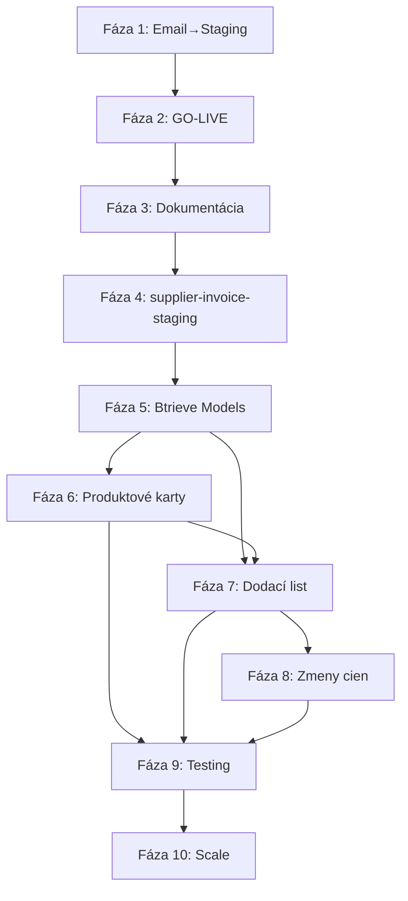

# Project Roadmap - NEX Automat

**Vytvorené:** 2025-11-26  
**Aktualizované:** 2025-12-13  
**Status:** 🔄 Aktívny dokument  
**Verzia:** 2.0

---

## Účel Dokumentu

Tento dokument definuje strategický plán vývoja NEX Automat projektu rozdelený do fáz s jasnými deliverables, závislosťami a milestone. Roadmap pokrýva cestu od základnej automatizácie až po produkčne pripravený multi-tenant systém.

---

## Súvisiace Dokumenty

- [TECHNOLOGY_DECISIONS.md](TECHNOLOGY_DECISIONS.md) - Technologické rozhodnutia
- [DATABASE_INDEX.md](../database/DATABASE_INDEX.md) - Databázová dokumentácia
- [APPLICATIONS_INDEX.md](../applications/APPLICATIONS_INDEX.md) - Aplikácie
- [ARCHIVE_INDEX.md](../archive/ARCHIVE_INDEX.md) - História sessions

---

## 1. PREHĽAD FÁZ

| Fáza | Názov | Status | Poznámka |
|------|-------|--------|----------|
| 1 | Email → Staging → GUI Zobrazenie | ✅ COMPLETE | supplier-invoice-loader v2.4 |
| 2 | GO-LIVE Preview/Demo | ✅ COMPLETE | Deployed @ Mágerstav |
| 3 | Dokumentácia a Refaktoring | 🟡 IN PROGRESS | Dec 2025 |
| 4 | supplier-invoice-staging (PySide6) | 🟡 IN PROGRESS | Nová aplikácia |
| 5 | Btrieve Models (TSH, TSI, PLS, RPC) | ⚪ TODO | Q1 2026 |
| 6 | Vytvorenie produktových kariet | ⚪ TODO | Q1 2026 |
| 7 | Zaevidovanie dodávateľského DL | ⚪ TODO | Q1 2026 |
| 8 | Požiadavky na zmenu cien | ⚪ TODO | Q2 2026 |
| 9 | Testovanie + Production Hardening | ⚪ TODO | Q2 2026 |
| 10 | Ďalší zákazníci + Rozšírenia | ⚪ FUTURE | Q3 2026+ |

---

## 2. DETAILNÝ POPIS FÁZ

### FÁZA 1: Email → Staging → GUI Zobrazenie ✅ COMPLETE

**Cieľ:** Automatické spracovanie faktúr až po zobrazenie v GUI

**Status:** ✅ Kompletné - Deployed v2.4 (2025-12-09)

**Deliverables:**

| Úloha | Status | Poznámka |
|-------|--------|----------|
| n8n workflow (IMAP → PDF → FastAPI) | ✅ | Produkcia |
| PDF extrakcia (pdfplumber + regex) | ✅ | L&Š extractor |
| ISDOC XML generátor | ✅ | XML standard |
| FastAPI service | ✅ | Port 8001 |
| PostgreSQL staging DB | ✅ | invoice_staging |
| NEX Lookup (EAN → PLU) | ✅ | GSCAT matching |
| GUI zobrazenie faktúr a položiek | ✅ | supplier-invoice-editor |
| Windows Service deployment | ✅ | NSSM |
| Cloudflare Tunnel konfigurácia | ✅ | Vzdialený prístup |

**Dokumentácia:**
- [supplier-invoice-loader dokumentácia](../applications/supplier-invoice-loader/)
- [Database: invoice_staging](../database/documents/)

---

### FÁZA 2: GO-LIVE Preview/Demo ✅ COMPLETE

**Cieľ:** Prezentácia systému zákazníkovi (Mágerstav)

**Status:** ✅ Kompletné - Production @ Mágerstav

**Deliverables:**

| Úloha | Status | Poznámka |
|-------|--------|----------|
| End-to-end test na reálnych dátach | ✅ | 278/359 items matched (77.4%) |
| Deployment na zákaznícky server | ✅ | Windows Server |
| Cloudflare Tunnel ako Windows Service | ✅ | NSSM |
| Dokumentácia pre operátora | ✅ | USER_GUIDE.md |
| Demo session so zákazníkom | ✅ | Prijatý do produkcie |

**Scope:**
- Operátor vidí faktúru v GUI
- Bez zápisu do NEX Genesis (len read-only)
- Validácia AI extrakcie

**Archív:** [2025-12-09-v2.4-deployment](../archive/sessions/)

---

### FÁZA 3: Dokumentácia a Refaktoring 🟡 IN PROGRESS

**Cieľ:** Systematická dokumentácia a technologický upgrade

**Status:** 🟡 Aktívne - December 2025

**Deliverables:**

| Úloha | Status | Poznámka |
|-------|--------|----------|
| Hierarchická dokumentačná štruktúra | ✅ | docs/ reorganizácia |
| Databázová dokumentácia (NEX Genesis) | ✅ | GSCAT, PAB, TSH, TSI mappings |
| Migration z PyQt5 na PySide6 | 🟡 | In progress |
| GUI_FRAMEWORK.md | ⚪ | Standards dokument |
| CODING_STANDARDS.md | ⚪ | Python best practices |
| Archive systematizácia | ✅ | sessions/ |

**Dokumentácia:**
- [Databázová dokumentácia](../database/)
- [GUI Framework](../system/GUI_FRAMEWORK.md)

---

### FÁZA 4: supplier-invoice-staging (PySide6) 🟡 IN PROGRESS

**Cieľ:** Nová GUI aplikácia pre staging management

**Status:** 🟡 Design phase - December 2025

**Deliverables:**

| Úloha | Status | Poznámka |
|-------|--------|----------|
| Aplikačná dokumentácia | 🟡 | SUPPLIER_INVOICE_STAGING.md |
| Databázová schéma | 🟡 | supplier_invoice_items |
| PySide6 framework setup | ⚪ | Nový tech stack |
| Zoznam faktúr (list view) | ⚪ | Main window |
| Detail faktúry (items grid) | ⚪ | Read-only fáza |
| Farebné rozlíšenie položiek | ⚪ | Matched vs unmatched |

**Technológie:**
- PySide6 (namiesto PyQt5)
- PostgreSQL (invoice_staging)
- Btrieve read-only (NEX Genesis)

**Dokumentácia:**
- [SUPPLIER_INVOICE_STAGING.md](../applications/supplier-invoice-staging/)
- [GUI_FRAMEWORK.md](../system/GUI_FRAMEWORK.md)

---

### FÁZA 5: Btrieve Models ⚪ TODO

**Cieľ:** Vytvorenie modelov pre zvyšné Btrieve tabuľky

**Status:** ⚪ Plánované Q1 2026

**Deliverables:**

| Úloha | Status | Dependencies |
|-------|--------|--------------|
| TSH Model (hlavička DL) | ⚪ | Database docs |
| TSI Model (položky DL) | ⚪ | Database docs |
| PLS Model (predajný cenník) | ⚪ | Database docs |
| RPC Model (požiadavky na zmeny cien) | ⚪ | Database docs |

**Technické úlohy:**
1. Analyzovať štruktúru TSHA-001.BTR
2. Analyzovať štruktúru TSIA-001.BTR
3. Analyzovať štruktúru PLSnnnnn.BTR
4. Analyzovať štruktúru RPCnnnnn.BTR
5. Vytvoriť Python modely v nexdata package
6. Unit testy pre READ operácie
7. Unit testy pre WRITE operácie

**Dokumentácia:**
- [TSH-supplier_delivery_heads.md](../database/documents/)
- [TSI-supplier_delivery_items.md](../database/documents/)

---

### FÁZA 6: Vytvorenie produktových kariet ⚪ TODO

**Cieľ:** Systém vie vytvoriť nové produkty v GSCAT

**Status:** ⚪ Plánované Q1 2026

**Deliverables:**

| Úloha | Status | Dependencies |
|-------|--------|--------------|
| Btrieve WRITE pre GSCAT | ⚪ | Fáza 5 |
| Automatické generovanie PLU (MAX+1) | ⚪ | Fáza 5 |
| Btrieve WRITE pre BARCODE | ⚪ | Fáza 5 |
| GUI: Výber tovarovej skupiny | ⚪ | Fáza 4 |
| GUI: Refresh PLU po vytvorení | ⚪ | Fáza 4 |
| Validácia (žiadny PLU = 0) | ⚪ | Fáza 4 |
| Error handling a rollback | ⚪ | Fáza 5 |

**Workflow:**
1. Operátor priradí skupinu všetkým novým položkám
2. Klikne "Vytvoriť nové položky"
3. Systém vytvorí GSCAT + BARCODE záznamy
4. Systém refreshne PLU
5. Validácia: všetky položky majú PLU > 0

**UI Farby:**

| Stav | Farba | Význam |
|------|-------|--------|
| PLU > 0 | 🟢 Zelená | Existuje v GSCAT |
| PLU = 0, bez skupiny | 🔴 Červená | Treba priradiť skupinu |
| PLU = 0, so skupinou | 🟡 Oranžová | Pripravené na vytvorenie |
| Cena zmenená | 🟡 Žltá | Pôjde do RPC |

**Dokumentácia:**
- [GSCAT-product_catalog.md](../database/catalogs/)
- [BARCODE-product_catalog_identifiers.md](../database/catalogs/)

---

### FÁZA 7: Zaevidovanie dodávateľského DL ⚪ TODO

**Cieľ:** Systém vie vytvoriť DL v NEX Genesis

**Status:** ⚪ Plánované Q1 2026

**Deliverables:**

| Úloha | Status | Dependencies |
|-------|--------|--------------|
| Btrieve WRITE pre TSH (hlavička) | ⚪ | Fáza 5 |
| Btrieve WRITE pre TSI (položky) | ⚪ | Fáza 5 |
| Automatické číslovanie dokladu | ⚪ | NUMBERING.md |
| Väzba na dodávateľa (PAB) | ⚪ | PAB models |
| Spätná kontrola súm | ⚪ | Business logic |
| Nastavenie status "Pripravený" | ⚪ | TSH flags |

**Workflow:**
1. Všetky položky majú PLU > 0
2. Operátor klikne "Zaevidovať DL"
3. Systém vytvorí TSH hlavičku
4. Systém vytvorí TSI položky
5. Spätná kontrola: suma TSI = suma XML
6. Označenie faktúry v staging ako completed

**Dokumentácia:**
- [DOCUMENT_TYPES.md](../documents/DOCUMENT_TYPES.md)
- [NUMBERING.md](../documents/NUMBERING.md)
- [WORKFLOWS.md](../documents/WORKFLOWS.md)

---

### FÁZA 8: Požiadavky na zmenu cien ⚪ TODO

**Cieľ:** Systém vie vytvoriť RPC záznamy

**Status:** ⚪ Plánované Q2 2026

**Deliverables:**

| Úloha | Status | Dependencies |
|-------|--------|--------------|
| Btrieve READ pre PLS (aktuálne ceny) | ⚪ | Fáza 5 |
| Btrieve WRITE pre RPC | ⚪ | Fáza 5 |
| GUI: Editácia predajnej ceny | ⚪ | Fáza 4 |
| GUI: Kontrola marže | ⚪ | Business logic |
| Automatické vytvorenie pri ukladaní DL | ⚪ | Fáza 7 |
| Väzba na PLU produktu | ⚪ | GSCAT |

**Workflow:**
1. Operátor zmení predajnú cenu (položka → žltá)
2. Pri ukladaní DL systém identifikuje žlté položky
3. Pre každú žltú položku vytvorí RPC záznam
4. RPC obsahuje: PLU, nová cena, dátum

---

### FÁZA 9: Testovanie + Production Hardening ⚪ TODO

**Cieľ:** Stabilný, produkčne pripravený systém

**Status:** ⚪ Plánované Q2 2026

**Deliverables:**

| Úloha | Status | Dependencies |
|-------|--------|--------------|
| End-to-end testy celého workflow | ⚪ | Fázy 4-8 |
| Stress testing (veľké faktúry) | ⚪ | Performance |
| Error recovery testy | ⚪ | Resilience |
| Automatický backup (Task Scheduler) | ⚪ | Operations |
| SMTP notifikácie overenie | ⚪ | Monitoring |
| Monitoring a alerting | ⚪ | Operations |
| Dokumentácia pre operátora | ⚪ | User guide |
| Troubleshooting guide | ⚪ | Support |

---

### FÁZA 10: Ďalší zákazníci + Rozšírenia ⚪ FUTURE

**Cieľ:** Škálovanie a vylepšenia

**Status:** ⚪ Budúcnosť Q3 2026+

**Deliverables:**

| Úloha | Status | Timeline |
|-------|--------|----------|
| Onboarding ANDROS | ⚪ | Q3 2026 |
| Onboarding ďalších zákazníkov | ⚪ | Q4 2026 |
| Extractory pre ďalších dodávateľov | ⚪ | On-demand |
| AI validácia extrakcie | ⚪ | Future |
| AI automatické priradenie skupín | ⚪ | Future |
| Priamy email bez operátora | ⚪ | Future |
| Dashboard a reporting | ⚪ | Future |

---

## 3. ZÁVISLOSTI MEDZI FÁZAMI



**Poznámka:** Fázy 6-8 môžu byť čiastočne paralelné po dokončení Fázy 5.

---

## 4. RIZIKÁ A MITIGÁCIE

| Riziko | Dopad | Pravdepodobnosť | Mitigácia |
|--------|-------|-----------------|-----------|
| Btrieve WRITE zlyhá | Vysoký | Stredná | Postupné testovanie, rollback mechanizmus |
| Neznáma štruktúra TSH/TSI | Stredný | Nízka | Analýza existujúcich dokladov v NEX Genesis |
| Výkon pri veľkých faktúrach | Stredný | Stredná | Batch processing, async operácie |
| Zákazník neschváli workflow | Vysoký | Nízka | Iteratívne demo, úpravy podľa feedback |
| PySide6 migrácia problémy | Stredný | Nízka | Systematická dokumentácia, postupný prechod |

---

## 5. TECHNICKÉ DLHY

| Položka | Popis | Priorita | Plán |
|---------|-------|----------|------|
| PyQt5 → PySide6 | supplier-invoice-editor | Vysoká | Fáza 3-4 |
| Test coverage | supplier-invoice-editor | Stredná | Fáza 9 |
| Automatický backup | Neexistuje | Stredná | Fáza 9 |
| Column mapping fix | plu_code overwrite | Vysoká | Fáza 4 |

---

## 6. MILESTONE CHECKLIST

### ✅ Milestone 1: GO-LIVE Preview (COMPLETE)

| Úloha | Status | Dátum |
|-------|--------|-------|
| Email → Staging funguje | ✅ | 2025-12-09 |
| GUI zobrazuje faktúry | ✅ | 2025-12-09 |
| Demo zákazníkovi | ✅ | 2025-12-09 |
| Production deployment | ✅ | 2025-12-09 |

### 🟡 Milestone 2: Dokumentácia (IN PROGRESS)

| Úloha | Status | Target |
|-------|--------|--------|
| Hierarchická štruktúra docs/ | ✅ | 2025-12-13 |
| Databázová dokumentácia | ✅ | 2025-12-10 |
| GUI_FRAMEWORK.md | ⚪ | 2025-12-15 |
| SUPPLIER_INVOICE_STAGING.md | 🟡 | 2025-12-15 |

### ⚪ Milestone 3: supplier-invoice-staging v1.0

| Úloha | Status | Target |
|-------|--------|--------|
| Základná aplikácia (PySide6) | ⚪ | Q1 2026 |
| Zoznam faktúr | ⚪ | Q1 2026 |
| Detail faktúry | ⚪ | Q1 2026 |
| Farebné rozlíšenie | ⚪ | Q1 2026 |

### ⚪ Milestone 4: Produktové karty

| Úloha | Status | Target |
|-------|--------|--------|
| GSCAT WRITE funguje | ⚪ | Q1 2026 |
| BARCODE WRITE funguje | ⚪ | Q1 2026 |
| Operátor vie vytvoriť nové produkty | ⚪ | Q1 2026 |

### ⚪ Milestone 5: Dodací list

| Úloha | Status | Target |
|-------|--------|--------|
| TSH WRITE funguje | ⚪ | Q1 2026 |
| TSI WRITE funguje | ⚪ | Q1 2026 |
| Operátor vie zaevidovať DL | ⚪ | Q1 2026 |

### ⚪ Milestone 6: Zmeny cien

| Úloha | Status | Target |
|-------|--------|--------|
| PLS READ funguje | ⚪ | Q2 2026 |
| RPC WRITE funguje | ⚪ | Q2 2026 |
| Automatické vytvorenie RPC | ⚪ | Q2 2026 |

### ⚪ Milestone 7: Production Ready

| Úloha | Status | Target |
|-------|--------|--------|
| Kompletný workflow testovaný | ⚪ | Q2 2026 |
| Error handling kompletný | ⚪ | Q2 2026 |
| Dokumentácia kompletná | ⚪ | Q2 2026 |
| Zákazník používa denne | ⚪ | Q2 2026 |

---

## 7. BUDÚCE ROZŠÍRENIA (Backlog)

### 7.1 AI Vylepšenia

| Funkcia | Popis | Priorita |
|---------|-------|----------|
| AI validácia extrakcie | Claude API kontrola regex výstupu | Medium |
| AI priradenie skupín | Automatické na základe názvu | High |
| AI fallback | Pri zlyhaní regex použiť AI | Medium |

### 7.2 Automatizácia

| Funkcia | Popis | Priorita |
|---------|-------|----------|
| Priamy email | Bez operátora v strede | Low |
| Auto-naskladnenie | Integrácia s NEX Genesis | Medium |
| Scheduled processing | Batch mód | Low |

### 7.3 Multi-tenant

| Funkcia | Popis | Priorita |
|---------|-------|----------|
| Dashboard | Pre všetkých zákazníkov | Medium |
| Reporting | Centralizované štatistiky | Low |
| Self-service | Customer portal | Low |

### 7.4 Ďalšie moduly

| Modul | Popis | Priorita |
|-------|-------|----------|
| Customer Orders | Spracovanie zákazníckych objednávok | Future |
| Inventory | Správa zásob | Future |
| Financial | Reporting | Future |

---

## 8. ČASOVÁ OS (TIMELINE)

```
2025 Q4: ✅ Fáza 1-2 Complete
2025 Q4: 🟡 Fáza 3 In Progress (Dokumentácia)
2026 Q1: 🟡 Fáza 4 Start (supplier-invoice-staging)
2026 Q1: ⚪ Fáza 5-7 (Btrieve Models + Write Operations)
2026 Q2: ⚪ Fáza 8-9 (Price Changes + Testing)
2026 Q3+: ⚪ Fáza 10 (Scale + Extensions)
```

---

**Dokument vytvorený:** 2025-11-26  
**Naposledy aktualizované:** 2025-12-13  
**Autor:** Zoltán Rausch & Claude AI  
**Verzia:** 2.0  
**Status:** 🔄 Living document - aktualizuje sa priebežne