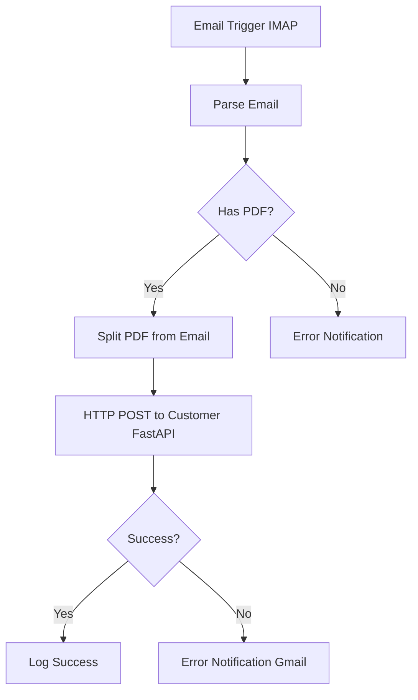

# Systémová Architektúra - NEX Automat

**Vytvorené:** 2025-11-26  
**Aktualizované:** 2025-12-13  
**Status:** 📐 Aktívny dokument  
**Verzia:** 2.0

---

## Účel Dokumentu

Tento dokument popisuje technickú architektúru NEX Automat systému - komponenty, ich vzájomné prepojenie, dátový tok, deployment a konfiguráciu.

---

## Súvisiace Dokumenty

- [PROJECT_VISION.md](../strategic/PROJECT_VISION.md) - Vízia a stratégia
- [PROJECT_ROADMAP.md](../strategic/PROJECT_ROADMAP.md) - Plán vývoja
- [TECHNOLOGY_DECISIONS.md](../strategic/TECHNOLOGY_DECISIONS.md) - Tech rozhodnutia
- [GUI_FRAMEWORK.md](GUI_FRAMEWORK.md) - PySide6 štandardy
- [DATABASE_INDEX.md](../database/DATABASE_INDEX.md) - Databázová dokumentácia
- [APPLICATIONS_INDEX.md](../applications/APPLICATIONS_INDEX.md) - Aplikácie

---

## 1. PREHĽAD ARCHITEKTÚRY

### 1.1 High-Level Diagram

```
┌─────────────────────────────────────────────────────────────┐
│                    ICC Server (Dev Center)                   │
│                                                               │
│  ┌─────────────────────────────────────────────────────┐   │
│  │              n8n Workflow Engine                     │   │
│  │  • Email monitoring (IMAP)                          │   │
│  │  • PDF extraction orchestration                     │   │
│  │  • Multi-customer workflows                         │   │
│  └─────────────────────────────────────────────────────┘   │
└───────────────────────────┬─────────────────────────────────┘
                             │
                    HTTPS (Cloudflare Tunnel)
                             │
┌────────────────────────────┴─────────────────────────────────┐
│              Zákaznícky Server (On-premise)                   │
│                                                                │
│  ┌──────────────────────────────────────────────────────┐   │
│  │         supplier-invoice-loader (FastAPI)             │   │
│  │  • PDF → Data extraction                             │   │
│  │  • XML (ISDOC) generation                            │   │
│  │  • PostgreSQL staging write                          │   │
│  │  • NEX Genesis lookup (read-only)                    │   │
│  └──────────────────────────────────────────────────────┘   │
│                             │                                  │
│  ┌──────────────────────────┴──────────────────────────┐    │
│  │          PostgreSQL (invoice_staging)                │    │
│  │  • Temporary invoice storage                         │    │
│  │  • Enrichment data (NEX lookup results)             │    │
│  └──────────────────────────────────────────────────────┘    │
│                             │                                  │
│  ┌──────────────────────────┴──────────────────────────┐    │
│  │   supplier-invoice-staging (PySide6) ← v3.0         │    │
│  │   supplier-invoice-editor (PyQt5) ← v2.4 deprecated │    │
│  │  • Invoice list view                                 │    │
│  │  • Item detail editing                               │    │
│  │  • Product matching UI                               │    │
│  │  • Validation & approval                             │    │
│  └──────────────────────────────────────────────────────┘    │
│                             │                                  │
│  ┌──────────────────────────┴──────────────────────────┐    │
│  │         NEX Genesis ERP (Btrieve)                    │    │
│  │  • Product catalog (GSCAT)                           │    │
│  │  • Partners (PAB)                                    │    │
│  │  • Supplier deliveries (TSH/TSI)                     │    │
│  │  • Price lists (PLS)                                 │    │
│  │  • Price change requests (RPC)                       │    │
│  └──────────────────────────────────────────────────────┘    │
└────────────────────────────────────────────────────────────────┘
```

### 1.2 Architektonické Princípy

| Princíp | Popis |
|---------|-------|
| **Centralizované workflow** | n8n na ICC serveri pre všetkých zákazníkov |
| **Decentralizované dáta** | Každý zákazník má vlastný server a dáta |
| **Priamy Btrieve prístup** | Bez middleware, priamo cez Btrieve client |
| **Human-in-the-loop** | Operátor validuje pred zápisom do NEX Genesis |
| **Staging pattern** | PostgreSQL ako buffer pred produkčným systémom |
| **Read-first, Write-later** | Najprv čítať (lookup), až potom písať (DL) |

---

## 2. KOMPONENTY

### 2.1 n8n Workflow Server (ICC)

**Účel:** Orchestrácia emailového monitoringu a PDF spracovania pre všetkých zákazníkov

**Technológie:**
- n8n (workflow automation platform)
- IMAP (email monitoring)
- HTTP client (API calls)

**Hlavný Workflow:** `n8n-SupplierInvoiceEmailLoader`



**Multi-customer Setup:**
```
n8n Workflows (ICC Server)
├── magerstav-supplier-invoices
│   ├── Email: magerstavinvoice@gmail.com
│   └── Endpoint: https://magerstav-invoices.icc.sk
├── andros-supplier-invoices (planned)
│   ├── Email: androsinvoice@gmail.com
│   └── Endpoint: https://andros-invoices.icc.sk
└── {customer}-supplier-invoices (template)
```

**Dokumentácia:**
- Workflow konfigurácia: `tools/n8n-workflows/`

---

### 2.2 FastAPI Service (Zákazník)

**Účel:** Príjem, extrakcia a uloženie faktúr

**Aplikácia:** `supplier-invoice-loader`

**Technológie:**
- Python 3.13
- FastAPI (async API framework)
- pdfplumber (PDF text extraction)
- Regex engines (pattern matching)
- asyncpg (PostgreSQL async driver)
- nexdata package (Btrieve read-only)

**Deployment:**
- Windows Service (NSSM)
- Port: 8001 (production)
- URL: http://localhost:8001
- Cloudflare Tunnel: HTTPS external access

**Štruktúra:**

```
apps/supplier-invoice-loader/
├── main.py                         # FastAPI app entry
├── src/
│   ├── api/
│   │   ├── models.py               # Pydantic models
│   │   └── routes.py               # API endpoints
│   ├── extractors/
│   │   ├── ls_extractor.py         # L&Š specific
│   │   ├── generic_extractor.py    # Generic fallback
│   │   └── base_extractor.py       # Abstract base
│   ├── business/
│   │   ├── isdoc_service.py        # ISDOC XML generator
│   │   ├── invoice_processor.py    # Main orchestration
│   │   └── product_matcher.py      # NEX lookup (EAN→PLU)
│   ├── database/
│   │   └── postgres_staging.py     # PostgreSQL models
│   ├── monitoring/
│   │   ├── health.py               # Health checks
│   │   └── metrics.py              # Prometheus metrics
│   └── utils/
│       ├── config.py               # Configuration
│       └── notifications.py        # Email alerts
├── config/
│   └── config_customer.py          # Per-customer config
└── tests/
    └── ...                         # Unit tests
```

**Kľúčové Endpointy:**

| Endpoint | Metóda | Popis |
|----------|--------|-------|
| `/health` | GET | Health check |
| `/api/v1/invoices/process` | POST | Process PDF invoice |
| `/api/v1/invoices/{id}` | GET | Get invoice by ID |
| `/metrics` | GET | Prometheus metrics |

**Dokumentácia:**
- [supplier-invoice-loader](../applications/supplier-invoice-loader/)

---

### 2.3 PostgreSQL Staging (Zákazník)

**Účel:** Dočasné úložisko pre spracovávané faktúry

**Databáza:** `invoice_staging`

**Hlavné Tabuľky:**

#### invoices_pending
```sql
CREATE TABLE invoices_pending (
    id SERIAL PRIMARY KEY,
    supplier_ico VARCHAR(20),
    supplier_name VARCHAR(255),
    invoice_number VARCHAR(50) UNIQUE,
    invoice_date DATE,
    due_date DATE,
    total_amount DECIMAL(15,2),
    total_vat DECIMAL(15,2),
    currency VARCHAR(3) DEFAULT 'EUR',
    status VARCHAR(20) DEFAULT 'pending',
    xml_path VARCHAR(500),
    pdf_path VARCHAR(500),
    created_at TIMESTAMP DEFAULT CURRENT_TIMESTAMP,
    processed_at TIMESTAMP
);
```

#### invoice_items_pending
```sql
CREATE TABLE invoice_items_pending (
    id SERIAL PRIMARY KEY,
    invoice_id INTEGER REFERENCES invoices_pending(id),
    line_number INTEGER,
    
    -- XML polia (originál z dodávateľa) - IMMUTABLE
    plu_code VARCHAR(50),              -- Čiarový kód (EAN)
    item_name VARCHAR(255),            -- Názov produktu
    quantity DECIMAL(10,3),            -- Množstvo
    unit VARCHAR(10),                  -- Merná jednotka
    unit_price DECIMAL(10,2),          -- Jednotková cena
    total_price DECIMAL(10,2),         -- Celková cena
    vat_rate DECIMAL(5,2),             -- DPH sadzba
    
    -- NEX Genesis polia (enrichment)
    nex_gs_code INTEGER,               -- PLU z GSCAT
    nex_name VARCHAR(255),             -- Názov z GSCAT
    in_nex BOOLEAN DEFAULT FALSE,      -- Našli sme v NEX?
    matched_by VARCHAR(20),            -- 'ean', 'name', 'manual'
    
    -- Validácia
    validation_status VARCHAR(20) DEFAULT 'pending',
    validation_errors TEXT,
    
    created_at TIMESTAMP DEFAULT CURRENT_TIMESTAMP
);
```

**Dokumentácia:**
- [DATABASE_INDEX.md](../database/DATABASE_INDEX.md)
- Migračné skripty: `packages/nex-shared/migrations/`

---

### 2.4 GUI Aplikácie (Zákazník)

#### A. supplier-invoice-staging (v3.0) 🟡 IN PROGRESS

**Účel:** Nová GUI aplikácia pre staging management

**Technológie:**
- Python 3.13
- **PySide6** (Qt6 bindings)
- asyncpg (PostgreSQL async)
- nexdata package (Btrieve read-only)

**Kľúčové Features:**
- Zoznam faktúr (list view)
- Detail faktúry (items grid)
- Farebné rozlíšenie (matched vs unmatched)
- Vytvorenie produktov (GSCAT write)
- Evidencia dodacích listov (TSH/TSI write)

**Dokumentácia:**
- [SUPPLIER_INVOICE_STAGING.md](../applications/supplier-invoice-staging/)

#### B. supplier-invoice-editor (v2.4) ✅ DEPRECATED

**Status:** Production @ Mágerstav, ale deprecated pre nových zákazníkov

**Technológie:**
- Python 3.13
- **PyQt5** (Qt5 bindings) ← deprecated
- asyncpg
- nexdata package

**Dôvod deprecation:**
- PyQt5 → PySide6 migration (lepšia licencia)
- Refaktoring UI komponenty
- Nová databázová schéma

---

### 2.5 NEX Genesis (Btrieve)

**Účel:** Produkčný ERP systém zákazníka

**Technológia:** Pervasive/Btrieve databázy

**Lokácia:** `C:\NEX\YEARACT\STORES\`

**Hlavné Tabuľky:**

| Tabuľka | Súbor | Účel | Dokumentácia |
|---------|-------|------|--------------|
| GSCAT | GSCAT.BTR | Katalóg produktov | [GSCAT-product_catalog.md](../database/catalogs/) |
| BARCODE | BARCODE.BTR | EAN kódy | [BARCODE-product_catalog_identifiers.md](../database/catalogs/) |
| PAB | PAB.BTR | Partneri | [PAB-partner_catalog.md](../database/catalogs/) |
| MGLST | MGLST.BTR | Tovarové skupiny | [MGLST-product_categories.md](../database/catalogs/) |
| STKLST | STKLST.BTR | Sklady | [STKLST-stocks.md](../database/stock/) |
| TSH | TSHA-001.BTR | Hlavičky dodacích listov | [TSH-supplier_delivery_heads.md](../database/stock/) |
| TSI | TSIA-001.BTR | Položky dodacích listov | [TSI-supplier_delivery_items.md](../database/stock/) |
| PLS | PLS00001.BTR | Predajný cenník | [PLSnnnnn-price_list_items.md](../database/sales/) |
| RPC | RPC00001.BTR | Požiadavky na zmeny cien | RPC dokumentácia |

**Prístup:**
- Read: cez `nexdata` package
- Write: cez `nexdata` package (plánované v3.0)

**Dokumentácia:**
- [DATABASE_INDEX.md](../database/DATABASE_INDEX.md)
- [TERMINOLOGY.md](TERMINOLOGY.md) - NEX Genesis moduly

---

## 3. DÁTOVÝ TOK

### 3.1 End-to-End Flow (v2.4 - Current)

```
┌─────────────────────────────────────────────────────────────┐
│ KROK 1: EMAIL PRÍJEM                                         │
│ Dodávateľ → magerstavinvoice@gmail.com                      │
└──────────────────────┬──────────────────────────────────────┘
                       │
┌──────────────────────▼──────────────────────────────────────┐
│ KROK 2: N8N WORKFLOW (ICC Server)                            │
│ • IMAP Trigger (každých 5 min)                              │
│ • Parse email → Extract PDF attachment                       │
│ • HTTP POST to FastAPI                                       │
└──────────────────────┬──────────────────────────────────────┘
                       │ HTTPS (Cloudflare Tunnel)
┌──────────────────────▼──────────────────────────────────────┐
│ KROK 3: FASTAPI PROCESSING (Zákazník Server)                │
│ • Receive PDF (base64)                                       │
│ • Extract data (pdfplumber + regex)                         │
│ • Generate ISDOC XML                                         │
│ • Save files (PDF + XML)                                     │
│ • Insert to PostgreSQL (invoices_pending)                   │
└──────────────────────┬──────────────────────────────────────┘
                       │
┌──────────────────────▼──────────────────────────────────────┐
│ KROK 4: NEX ENRICHMENT                                       │
│ FOR EACH invoice_item:                                       │
│   • Read plu_code (EAN)                                      │
│   • Lookup in BARCODE.BTR → GsCode                          │
│   • Lookup in GSCAT.BTR → Product details                   │
│   • UPDATE invoice_items_pending:                           │
│     - nex_gs_code = GsCode                                   │
│     - nex_name = Product name                                │
│     - in_nex = TRUE/FALSE                                    │
│     - matched_by = 'ean'/'name'/'manual'                    │
└──────────────────────┬──────────────────────────────────────┘
                       │
┌──────────────────────▼──────────────────────────────────────┐
│ KROK 5: GUI ZOBRAZENIE (supplier-invoice-editor v2.4)       │
│ • Operátor otvorí GUI                                        │
│ • Zobrazí zoznam faktúr (invoices_pending)                  │
│ • Otvorí detail faktúry                                      │
│ • Farebné rozlíšenie položiek:                              │
│   - Zelená: in_nex = TRUE                                    │
│   - Červená: in_nex = FALSE                                  │
│ • Validácia, editácia                                        │
└──────────────────────┬──────────────────────────────────────┘
                       │
┌──────────────────────▼──────────────────────────────────────┐
│ KROK 6: SCHVÁLENIE (v3.0 - Planned)                         │
│ • Operátor schváli faktúru                                   │
│ • Systém vytvorí nové produkty (GSCAT write)                │
│ • Systém vytvorí dodací list (TSH/TSI write)                │
│ • Systém vytvorí price change requests (RPC write)          │
└──────────────────────┬──────────────────────────────────────┘
                       │
┌──────────────────────▼──────────────────────────────────────┐
│ KROK 7: VÝSLEDOK                                             │
│ • Dodávateľský DL v NEX Genesis (status "Pripravený")       │
│ • Operátor dokončí naskladnenie v NEX Genesis               │
│ • Faktúra archivovaná v staging DB                          │
└─────────────────────────────────────────────────────────────┘
```

### 3.2 Dátové Transformácie

**PDF → Data:**
```
PDF faktúra
  ↓ pdfplumber
Text (raw)
  ↓ Regex patterns
Structured data (dict)
```

**Data → XML:**
```
Structured data (dict)
  ↓ ISDOC service
ISDOC XML (standard)
  ↓ File write
C:\NEX\IMPORT\XML\{invoice_number}.xml
```

**XML → PostgreSQL:**
```
ISDOC XML
  ↓ Parser
Invoice + Items (objects)
  ↓ SQL INSERT
PostgreSQL (invoice_staging)
```

**PostgreSQL → NEX Genesis:**
```
invoice_items_pending
  ↓ EAN lookup (BARCODE → GSCAT)
Enriched items (nex_gs_code, nex_name)
  ↓ GUI validation
Approved items
  ↓ Btrieve WRITE (v3.0)
TSH/TSI records in NEX Genesis
```

---

## 4. BEZPEČNOSŤ

### 4.1 Autentifikácia

| Spojenie | Metóda | Detaily |
|----------|--------|---------|
| n8n → FastAPI | API Key | `X-API-Key` header |
| FastAPI → PostgreSQL | Password | Environment variable |
| GUI → PostgreSQL | Password | Config file (encrypted) |
| GUI → Btrieve | File access | Windows permissions |

**API Key Management:**
```python
# FastAPI
@app.post("/api/v1/invoices/process")
async def process_invoice(
    api_key: str = Header(..., alias="X-API-Key")
):
    if api_key != settings.API_KEY:
        raise HTTPException(401, "Invalid API key")
```

### 4.2 Sieťová Bezpečnosť

**Firewall Rules:**
```
✅ ALLOW: localhost:8001 (FastAPI)
✅ ALLOW: localhost:5432 (PostgreSQL)
❌ DENY: External access to 8001, 5432
✅ ALLOW: Cloudflare Tunnel (outbound only)
```

**Cloudflare Tunnel:**
- Outbound connection from customer server
- No inbound ports opened
- HTTPS encryption
- DDoS protection

### 4.3 Dátová Bezpečnosť

**Lokácia Dát:**
- ✅ PDF/XML: Zákaznícky server (`C:\NEX\IMPORT\`)
- ✅ PostgreSQL: Zákaznícky server (localhost)
- ✅ Btrieve: Zákaznícky server (`C:\NEX\`)
- ❌ Žiadne dáta na ICC serveri (len workflow logs)

**Backup:**
- PostgreSQL: Automatický daily backup
- Btrieve: NEX Genesis backup systém
- PDF/XML: File system backup

---

## 5. KONFIGURÁCIA

### 5.1 supplier-invoice-loader

```python
# apps/supplier-invoice-loader/config/config_customer.py
import os

# Customer identification
CUSTOMER_CODE = "MAGERSTAV"
CUSTOMER_NAME = "Mágerstav s.r.o."

# API settings
API_HOST = "0.0.0.0"
API_PORT = 8001
API_KEY = os.getenv("LS_API_KEY")  # From environment

# File storage
PDF_STORAGE_PATH = r"C:\NEX\IMPORT\PDF"
XML_STORAGE_PATH = r"C:\NEX\IMPORT\XML"

# PostgreSQL
POSTGRES_ENABLED = True
POSTGRES_HOST = "localhost"
POSTGRES_PORT = 5432
POSTGRES_DB = "invoice_staging"
POSTGRES_USER = os.getenv("POSTGRES_USER")
POSTGRES_PASSWORD = os.getenv("POSTGRES_PASSWORD")

# NEX Genesis
NEX_GENESIS_ENABLED = True
NEX_DATA_PATH = r"C:\NEX\YEARACT\STORES"
```

### 5.2 supplier-invoice-staging (v3.0)

```python
# apps/supplier-invoice-staging/config/config.py

# PostgreSQL
POSTGRES_HOST = "localhost"
POSTGRES_PORT = 5432
POSTGRES_DB = "invoice_staging"
POSTGRES_USER = os.getenv("POSTGRES_USER")
POSTGRES_PASSWORD = os.getenv("POSTGRES_PASSWORD")

# NEX Genesis (Btrieve)
NEX_DATA_PATH = r"C:\NEX\YEARACT\STORES"

# Business rules
PRICE_LIST_NUMBER = "00001"        # PLS00001.BTR
MIN_MARGIN_PERCENT = 15.0
DEFAULT_STOCK_NUMBER = 1           # Hlavný sklad
```

**Environment Variables:**
```bash
# .env file (NOT in Git)
LS_API_KEY=secret_key_here
POSTGRES_USER=nex_automat
POSTGRES_PASSWORD=secret_password_here
ANTHROPIC_API_KEY=sk-ant-...  # Pre budúce AI features
```

---

## 6. DEPLOYMENT

### 6.1 ICC Server

**Platform:** Linux/Docker

| Služba | Typ | Port | Status |
|--------|-----|------|--------|
| n8n | Docker Container | 5678 | ✅ Running |
| PostgreSQL | Docker Container | Internal | ✅ Running |

### 6.2 Zákaznícky Server - Mágerstav

**Platform:** Windows Server

| Služba | Typ | Port/Path | Status |
|--------|-----|-----------|--------|
| supplier-invoice-loader | Windows Service (NSSM) | 8001 | ✅ Production |
| PostgreSQL 16 | Windows Service | 5432 | ✅ Production |
| Cloudflare Tunnel | Windows Service (NSSM) | N/A | ✅ Production |
| supplier-invoice-editor | Desktop App | N/A | ✅ Manual start |
| NEX Genesis | Existing | C:\NEX | ✅ Production |

**Service Management:**
```powershell
# Check status
Get-Service -Name "NEXAutomat"
Get-Service -Name "postgresql-x64-16"

# Restart services
Restart-Service -Name "NEXAutomat"

# View logs
Get-Content C:\Deployment\nex-automat\logs\service-stderr.log -Tail 50
```

### 6.3 File System Layout

```
C:\NEX\
├── YEARACT\
│   └── STORES\              # Btrieve databázy (NEX Genesis)
│       ├── GSCAT.BTR
│       ├── BARCODE.BTR
│       ├── PAB.BTR
│       ├── MGLST.BTR
│       ├── TSHA-001.BTR
│       ├── TSIA-001.BTR
│       ├── PLS00001.BTR
│       └── RPC00001.BTR
└── IMPORT\                  # NEX Automat súbory
    ├── PDF\                 # Originálne faktúry
    │   └── {invoice_number}.pdf
    └── XML\                 # ISDOC výstup
        └── {invoice_number}.xml

C:\Development\nex-automat\  # Development directory
C:\Deployment\nex-automat\   # Production deployment
```

---

## 7. MONITORING & OBSERVABILITY

### 7.1 Health Checks

**FastAPI Endpoints:**

| Endpoint | Response | Použitie |
|----------|----------|----------|
| GET `/health` | `{"status":"healthy"}` | Liveness probe |
| GET `/health/db` | Database connectivity | Readiness probe |
| GET `/health/nex` | Btrieve connectivity | NEX Genesis check |

**Monitoring Script:**
```powershell
# Check FastAPI health
$response = Invoke-RestMethod -Uri "http://localhost:8001/health"
if ($response.status -eq "healthy") {
    Write-Host "✅ Service is healthy"
} else {
    Write-Host "❌ Service is unhealthy"
}
```

### 7.2 Metrics

**Prometheus Endpoints:**
```
GET /metrics              # Prometheus format
GET /metrics/json         # JSON format
```

**Key Metrics:**
- `invoices_processed_total` - Celkový počet faktúr
- `invoices_processing_duration_seconds` - Doba spracovania
- `nex_lookup_success_rate` - Úspešnosť NEX lookup
- `api_requests_total` - API requesty

### 7.3 Logging

**FastAPI Logging:**
```
C:\Deployment\nex-automat\logs\
├── service-stdout.log    # Standard output
├── service-stderr.log    # Errors
└── app.log               # Application log
```

**Log Levels:**
```python
import logging

logging.basicConfig(
    level=logging.INFO,
    format='%(asctime)s - %(name)s - %(levelname)s - %(message)s'
)
```

### 7.4 Alerting

**Email Notifications:**
- n8n workflow errors → Gmail
- FastAPI critical errors → SMTP
- Database connection failures → SMTP

**Alert Conditions:**
- Service down
- Database unreachable
- Processing failure rate >5%
- Disk space <10GB

---

## 8. ŠKÁLOVATEĽNOSŤ

### 8.1 Multi-Customer Architecture

```
┌─────────────────────────────────────────────────────┐
│           ICC Server (n8n)                           │
│                                                       │
│  ┌──────────────────────────────────────────────┐  │
│  │ Workflow: Mágerstav                           │  │
│  │ • Email: magerstavinvoice@gmail.com          │  │
│  │ • Endpoint: magerstav-invoices.icc.sk        │  │
│  └──────────────────────────────────────────────┘  │
│                                                       │
│  ┌──────────────────────────────────────────────┐  │
│  │ Workflow: ANDROS (planned)                    │  │
│  │ • Email: androsinvoice@gmail.com             │  │
│  │ • Endpoint: andros-invoices.icc.sk           │  │
│  └──────────────────────────────────────────────┘  │
│                                                       │
│  ┌──────────────────────────────────────────────┐  │
│  │ Workflow: Customer X (template)               │  │
│  │ • Email: {customer}@domain.com               │  │
│  │ • Endpoint: {customer}-invoices.icc.sk       │  │
│  └──────────────────────────────────────────────┘  │
└─────────────────────────────────────────────────────┘
```

### 8.2 Pridanie Nového Zákazníka

**Checklist:**

1. **n8n Workflow**
   - [ ] Kopírovať template workflow
   - [ ] Nastaviť email trigger (nová schránka)
   - [ ] Nakonfigurovať endpoint URL
   - [ ] Nastaviť API key

2. **Zákaznícky Server**
   - [ ] Nainštalovať Python 3.13
   - [ ] Deploy supplier-invoice-loader
   - [ ] Nainštalovať PostgreSQL
   - [ ] Vytvoriť databázu invoice_staging
   - [ ] Nakonfigurovať Cloudflare Tunnel
   - [ ] Nainštalovať supplier-invoice-staging GUI

3. **Konfigurácia**
   - [ ] Nastaviť config_customer.py
   - [ ] Nastaviť environment variables
   - [ ] Nakonfigurovať NEX Genesis path

4. **Testing**
   - [ ] Test email → n8n → FastAPI
   - [ ] Test PDF extraction
   - [ ] Test PostgreSQL write
   - [ ] Test NEX Genesis read
   - [ ] Test GUI zobrazenie

**Odhadovaný čas:** 4-6 hodín pre skúseného technika

---

## 9. PERFORMANCE

### 9.1 Benchmarky (v2.4 - Mágerstav)

| Metrika | Hodnota | Target |
|---------|---------|--------|
| PDF extraction | ~2s | <5s |
| NEX lookup (1 item) | ~50ms | <100ms |
| PostgreSQL insert | ~10ms | <50ms |
| End-to-end (10 items) | ~3s | <10s |
| Concurrent requests | 5+ | 10+ |

### 9.2 Optimalizácie

**Implementované:**
- ✅ Async I/O (FastAPI)
- ✅ Connection pooling (PostgreSQL)
- ✅ Batch NEX lookups

**Plánované:**
- ⚪ Caching (Redis) - v4.0
- ⚪ Queue system (RabbitMQ) - v4.0
- ⚪ Horizontal scaling - v5.0

---

## 10. ZNÁME LIMITÁCIE

### 10.1 Technické

| Limitácia | Dôvod | Riešenie |
|-----------|-------|----------|
| Single-threaded Btrieve | Pervasive limitation | Use connection pooling |
| No Btrieve transactions | Legacy architecture | Implement application-level rollback |
| Windows-only | NEX Genesis requirement | Accept limitation |

### 10.2 Biznis

| Limitácia | Dôvod | Riešenie |
|-----------|-------|----------|
| One extractor per supplier | Custom PDF formats | Create new extractors as needed |
| Manual product creation | v2.4 scope | Automate in v3.0 |
| No price updates | v2.4 scope | Implement RPC in v3.0 |

---

## ZÁVER

NEX Automat architektúra je navrhnutá pre:
- ✅ **Spoľahlivosť** - proven technologies, simple stack
- ✅ **Škálovateľnosť** - multi-customer support
- ✅ **Udržiavateľnosť** - clear separation of concerns
- ✅ **Bezpečnosť** - data stays on-premise
- ✅ **Evolúcia** - gradual path to full automation

**Kľúčové rozhodnutia:**
1. Centralizovaný n8n pre orchestráciu
2. Decentralizované dáta (zákaznícke servery)
3. Staging pattern (PostgreSQL buffer)
4. Human-in-the-loop (validácia)
5. PySide6 pre GUI (v3.0+)

---

**Vytvoril:** Zoltán Rausch & Claude AI  
**Naposledy aktualizované:** 2025-12-13  
**Status:** 📐 Living document  
**Verzia:** 2.0